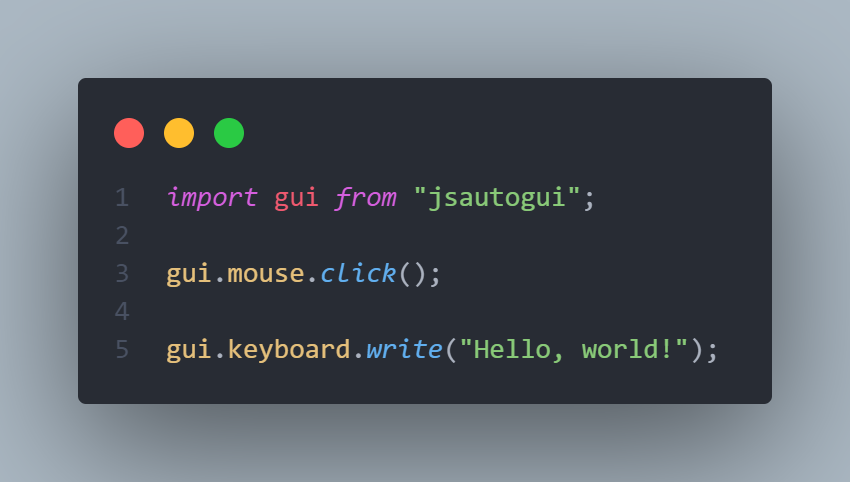

# JSAutoGui

> JSAutoGUI is an npm package for Node.js. Inspired by pyautogui from Python (but noticeably faster and better).



# How to use?

You can install `jsautogui` to your project by typing this in your terminal:

**Linux Dependencies:**
If you are on Linux (Ubuntu/Debian), install the required dependencies first:

```shell
sudo apt-get install -y libxtst-dev libx11-dev
```

**Windows Dependencies:**
If you are on Windows, you need the build tools to compile the C++ addon.

1. Download and
   install [Visual Studio Build Tools](https://www.google.com/search?q=https://visualstudio.microsoft.com/visual-cpp-build-tools/).
2. During installation, ensure you select the **"Desktop development with C++"** workload.

**Install Package:**

```shell
npm install jsautogui
```

After this, you can start using the package by importing it:

```js
import jsautogui from "jsautogui"; // in modulejs
// or
const jsautogui = require("jsautogui"); // in commonjs
```

### [You can see a list of all functions in here: JSAutoGUI Wiki](https://github.com/OguzhanUmutlu/jsautogui/wiki)

---

# How to contribute/fork/edit?

This project mixes **C++** (for native system calls) and **TypeScript** (for the Node.js interface).

### 1. Clone and Setup

Clone the project and install dependencies:

```bash
git clone [https://github.com/OguzhanUmutlu/jsautogui.git](https://github.com/OguzhanUmutlu/jsautogui.git)
cd jsautogui
npm install
```

### 2. IDE Setup (CLion)

This project is configured to work seamlessly with **CLion** for both C++ and TypeScript development.

1. Open the `jsautogui` folder in CLion.
2. **C++:** CLion will detect the `CMakeLists.txt` file automatically. This provides full IntelliSense for the native
   code in `src/`.
3. **TypeScript:** You can edit `index.ts` directly. CLion uses the included `tsconfig.json` to handle syntax
   highlighting and errors.

### 3. Building

Since this project uses TypeScript, you need to compile the TS files *and* build the C++ addon. I have set up a script
to handle this automatically:

```bash
# Compiles TypeScript and rebuilds the C++ addon
npm run build
```

---

# Testing

To ensure your changes work as expected, you can use the built-in test scripts defined in `package.json`.

**Run tests (fast):**
If you have already built the project and just changed the test logic:

```bash
npm run test
```

**Build & Run tests (full):**
If you have modified C++ or TypeScript source code and want to verify everything:

```bash
npm run test-build
```
